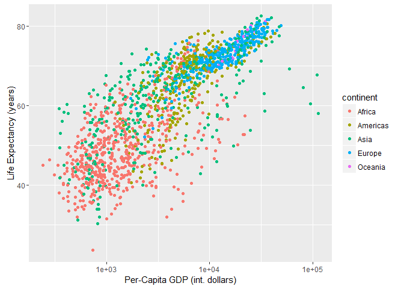
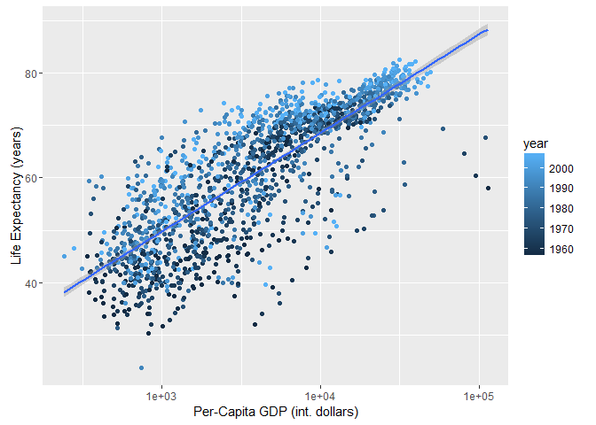

# Gapminder Group Project
David Dvorak, Elton Chan, Fanli Si, Jingyang Liu  
November 16, 2016  


# Our Hypothesis:
Countries with higher per-capita GDP have higher life expectancies.

# Our Analysis:


A couple potential plots:

```r
df <- gapminder %>%
  mutate(gdpPercap_change = 100*((gdpPercap - lag(gdpPercap)))/gdpPercap) %>%
  mutate(lifeExp_change = 100*((lifeExp - lag(lifeExp)))/lifeExp) %>%
  filter(year > 1952)

qplot(log(gdpPercap),lifeExp,data=df, color = continent)
```

<!-- -->

```r
qplot(log(gdpPercap),lifeExp,data=df, color = year)
```

<!-- -->


A follow-up question on the relationship between GDP and life expectancy is whether or not the rate of change of a country's life expectancy is impacted by the rate of change of its per-capita GDP. 


```r
ggplot(df, aes(x=gdpPercap_change,y=lifeExp_change, color = continent)) + geom_point() + geom_smooth(method=lm, se = FALSE) + ylim(-25,25) + xlim(-50,50) + labs(title="Comparing Growth Rates of Life Expectancy and Per-Capita GDP") +
  labs(x="Per-Capita GDP Growth Rate (%)", y="Life Expectancy Growth Rate (%)")
```

```
## Warning: Removed 24 rows containing non-finite values (stat_smooth).
```

```
## Warning: Removed 24 rows containing missing values (geom_point).
```

<!-- -->

The scatterplot includes linear regression lines for each continent and the fitting results are as follows:


```r
fit_africa <- lm(lifeExp_change ~ gdpPercap_change, data = (df %>% filter(continent == 'Africa')))
summary(fit_africa)
```

```
## 
## Call:
## lm(formula = lifeExp_change ~ gdpPercap_change, data = (df %>% 
##     filter(continent == "Africa")))
## 
## Residuals:
##     Min      1Q  Median      3Q     Max 
## -88.826  -0.552   0.986   2.265  32.585 
## 
## Coefficients:
##                  Estimate Std. Error t value Pr(>|t|)    
## (Intercept)       2.70734    0.25087  10.792   <2e-16 ***
## gdpPercap_change  0.02753    0.01483   1.856    0.064 .  
## ---
## Signif. codes:  0 '***' 0.001 '**' 0.01 '*' 0.05 '.' 0.1 ' ' 1
## 
## Residual standard error: 5.832 on 570 degrees of freedom
## Multiple R-squared:  0.006008,	Adjusted R-squared:  0.004264 
## F-statistic: 3.445 on 1 and 570 DF,  p-value: 0.06396
```
